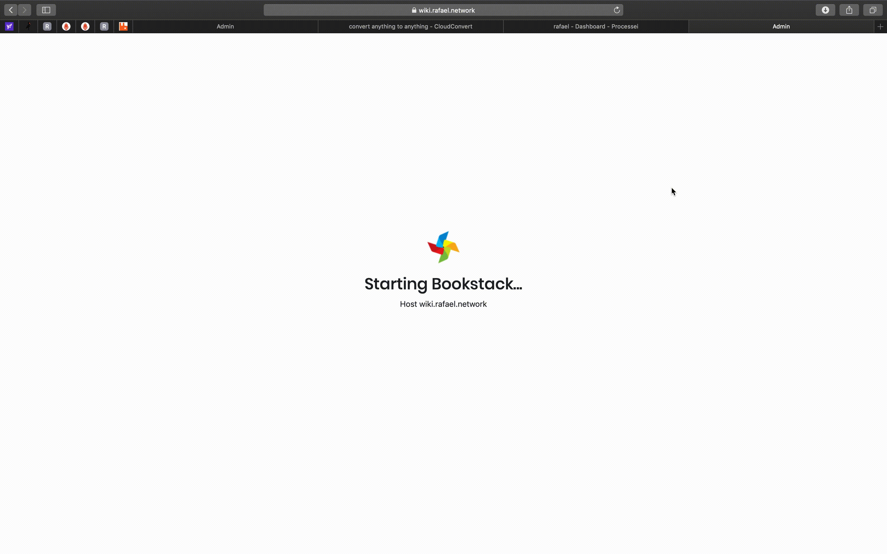

# Startup Proxy

Startup proxy is a app that comunicates with Kubernetes API server to scale up and down resources that can be used temporarely (Ex: Gogs, Gitlab, Jenkins, Concourse CI, Bookstack, LDAP Admin, etc...). With Startup proxy resources are scaled down to 0 replicas when you are not using it, and scaled up when you access it imediately.

My cluster has some pretty heavy batch jobs that run at night, resources like CI, version control dont need to be up and running at this point.

Default username: *admin*
Default password: *admin*

### Example

### License

Copyright 2019 Rafael Gonçalves

Permission is hereby granted, free of charge, to any person obtaining a copy of this software and associated documentation files (the "Software"), to deal in the Software without restriction, including without limitation the rights to use, copy, modify, merge, publish, distribute, sublicense, and/or sell copies of the Software, and to permit persons to whom the Software is furnished to do so, subject to the following conditions:

The above copyright notice and this permission notice shall be included in all copies or substantial portions of the Software.

THE SOFTWARE IS PROVIDED "AS IS", WITHOUT WARRANTY OF ANY KIND, EXPRESS OR IMPLIED, INCLUDING BUT NOT LIMITED TO THE WARRANTIES OF MERCHANTABILITY, FITNESS FOR A PARTICULAR PURPOSE AND NONINFRINGEMENT. IN NO EVENT SHALL THE AUTHORS OR COPYRIGHT HOLDERS BE LIABLE FOR ANY CLAIM, DAMAGES OR OTHER LIABILITY, WHETHER IN AN ACTION OF CONTRACT, TORT OR OTHERWISE, ARISING FROM, OUT OF OR IN CONNECTION WITH THE SOFTWARE OR THE USE OR OTHER DEALINGS IN THE SOFTWARE.